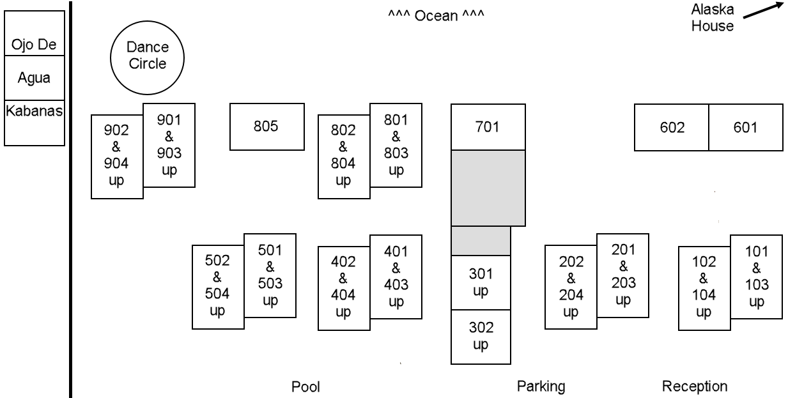

----- From form ---

We have booked the entire Hotel Las Arenas Puerto Morelos for 10 nights (Feb 11 check in to Feb 21 check out) and several rooms for a few additional nights before and after.

As we learned during camp last year, retail prices for the rooms have risen (to as much as 1800 pesos/night) with beachside rooms now costing more than poolside rooms. But miraculously, the total hotel group rate we negotiated amazingly allows us to charge the same 1200 pesos per night as last year ($70usd @ 17.14 pesos/dollar) for ***10-night-stay\*** beachside rooms and even less for poolside rooms!

***All prices below are in Mexican pesos. The actual dollar (USD or CDN) price you pay gets determined using the exchange rate at the time you pay.\*** ***All dollars collected will be converted to pesos at the time collected.\***

No one knows what the impact of the US presidential election will have on the money markets, so we are giving you the ability to decide when your dollars get converted to pesos. You can either:

- Pay sooner to avoid unknown future exchange rate fluctuations.
- Pay later to hang on to your money until you feel the time is right for you.

Complete and submit this form to request lodging at Hotel Las Arenas.

-----

- 10-nights (Feb 11-21) - 12,000 beachside, 11,000 poolside
- 9 nights - 12,000 beachside, 11,000 poolside
- 8 nights - 11,000 beachside, 10,300 poolside
- 7 nights - 10,000 beachside, 9,600 poolside
- 6 nights - 9,000 beachside, 8,900 poolside
- Each night > 10 - 1200 beachside, 1100 poolside

Recent pesos per USD exchange rate highs and lows (with example USD conversion for 12,000 pesos):

- 5/31: 16.97 current (eg.12,000 pesos = $707.13)
- 5/30: 17.12 high (eg.12,000 pesos = $700.93)
- 5/20: 16.57 low (eg. 12,000 pesos = $724.20)
- 4/25: 17.20 high (eg. 12,000 pesos = $697.67)
- 4/08: 16.33 low (eg. 12,000 pesos = $734.84)
- 3/18: 16.84 high (eg. 12,000 pesos = $712.59)
- 3/13: 16.67 low (eg. 12,000 pesos = $719.86)
- 1/23: 17.31 high (eg. 12,000 pesos = $693.24)

Please give your best guess for your dates below. Camp will most likely unoffically start Wed, Feb 12 with dance-space prep and a dance that evening, just like last year. If, when you book plane tickets, your dates need to change slightly, please contact us immediately and we'll do what we can to accomodate you. 

-----

We have booked the entire 30-room Hotel Las Arenas Puerto Morelos for 10 nights (Feb 11 check in to Feb 21 check out) and several of the rooms for a few additional nights before and after. On December 1, we will need to release the unbooked additional rooms back to the hotel, so the sooner you book, the better chance a room will be available for your dates.

As we learned during camp last year, retail prices for the rooms have risen (to as much as 1800 pesos/night) with beachside rooms now costing more than poolside rooms. ***But miraculously***, the total hotel group rate we negotiated amazingly allows us to charge the same peso amount per night as last year (~$70usd @ 17 pesos/dollar) for 10-night-stay beachside rooms and ***even less*** for poolside rooms!

**Total prices listed here are in Mexican pesos.** *The actual dollar (USD or CDN) price you pay gets determined using the exchange rate at the time you pay.* This approach:

*  Allows us to offer you the same peso price as last year.

* Gives you the flexibility to pay when you feel most comfortable doing so. No one knows what the impact of the US presidential election will have on the money markets, so this approach gives you options. You can either:

  * Pay sooner to avoid unknown future exchange rate fluctuations.

  * Pay later to hang on to your money until you feel the time is right for you.

### Hotel Las Arenas Pricing Options***

| Nights | Beachside Total Pesos (usd/night) | Poolside Total Pesos (usd/night) |
| :--------------------------------------------------------: | :----------------------------------: | :----------------------------------: |
| 10-night block (Feb 11-21)* |            **12,000** (~$70.59**)            | **11,000** (~$64.70**) |
| 9 nights                                                |            **12,000** (~$78.43**)            | **11,000** (~$71.90**) |
| 8 nights                                                |            **11,000** (~$80.88**)            | **10,300** (~$75.74**) |
| 7 nights                                                |            **10,000** (~$84.03**)            | **9,600** (~$80.67**) |
| 6 nights                                                |            **9,000** (~$88.24**)            | **8,900** (~$87.25**) |

\* Add up to 10 additional nights (before and/or after) for the same price per night. Additional discount available for 21+ nights.

\** *The USD per night amount listed is based on an exchange rate of 17 pesos/dollar. The actual dollar (CDN or USD) price you pay gets determined using the exchange rate at the time you pay.*

\*\*\* All prices include ~20 peso/night guaranteed housekeeper gratuity and we encourage you to leave more.

# Reserve your room
Complete and submit [**the Las Arenas booking form**](https://docs.google.com/forms/d/e/1FAIpQLSct3SrTHl76pMYcZ5z9-eWdLCjCXzf4igqfVk689qA42YuyWA/viewform){:target="_blank"} to reserve your room now and either pay now or anytime in 2024. You can:

* Pay directly in pesos (through Wise) - Great option for Canadians to avoid double conversion fee!
* Pay in USD (through PayPal or Venmo) - Just like we did last year.
* If none of those work for you, pay by check.

<!-- Keep next two lines on one to lessen vertical spacing -->
### Hotel Las Arenas Building Layout {:.thinblackborder}