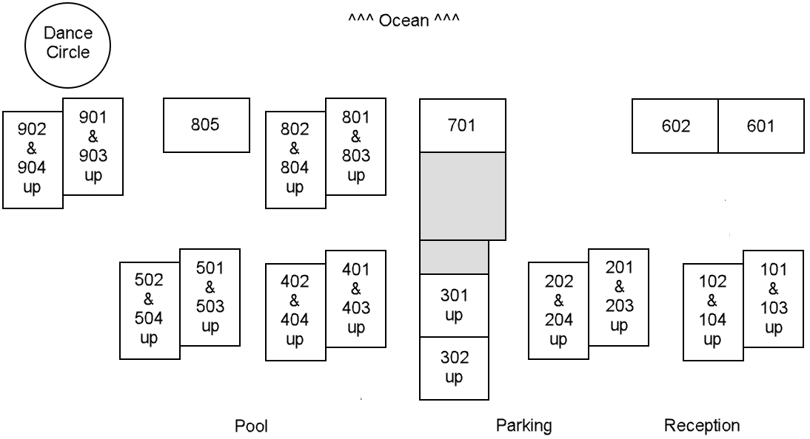

We have booked the entire 30-room Hotel Las Arenas Puerto Morelos for 10 nights (Feb 11 check in to Feb 21 check out) and several of the rooms for a few additional nights before and after. On December 1, we will need to release the unbooked additional rooms back to the hotel, so the sooner you book, the better chance a room will be available for your dates.

As we learned during camp last year, retail prices for the rooms have risen (to as much as 1800 pesos/night) with beachside rooms now costing more than poolside rooms. ***But miraculously***, the total hotel group rate we negotiated amazingly allows us to charge the same amount as last year (~$70usd @ 17 pesos/dollar) for 10-night-stay beachside rooms and ***even less*** for poolside rooms!

**All prices listed here are in Mexican pesos.** *The actual dollar (CDN or USD) price you pay gets determined using the exchange rate at the time you pay.* This approach:

*  Allows us to offer you the same peso price as last year.

* Gives you the flexibility to pay when you feel most comfortable doing so. Either:

  * Pay sooner to avoid future exchange rate fluctuations.

  * Pay later to hang on to your money longer.

### Hotel Las Arenas Pricing Options***

| Nights                                                  | Beachside Pesos/Night | Poolside Pesos/Night       |
| :--------------------------------------------------------: | :----------------------------------: | :-------------------------: |
| 10-night block (Feb 11-21)* |            **1200** (~$70.59**)            | **1100** (~$64.70**) |
| 8-9 nights                                                |            **1300** (~$76.47**)            | **1200** (~$70.59**) |
| 6-7 nights                                                |            **1400** (~$82.35**)            | **1300** (~$76.47**) |
| 21+ nights | Contact Dave |Contact Dave|

\* Add up to 10 additional nights for the same price per night.

\** *The USD amount listed is based on an exchange rate of 17 pesos/dollar. The actual dollar (CDN or USD) price you pay gets determined using the exchange rate at the time you pay.*

\*\*\* All prices include ~20 peso/night guaranteed housekeeper gratuity and we encourage you to leave more.

# Reserve your room
Complete and submit [**the Las Arenas booking form**](https://docs.google.com/forms/d/e/1FAIpQLSct3SrTHl76pMYcZ5z9-eWdLCjCXzf4igqfVk689qA42YuyWA/viewform){:target="_blank"} to reserve your room now and either pay now or anytime in 2023. You can:

* Pay directly in pesos (through Wise) - Great option for Canadians to avoid double conversion fee!
* Pay in USD (through PayPal or Venmo) - Just like we did last year.

<!-- Keep next two lines on one to lessen vertical spacing -->
### Hotel Las Arenas Building Layout {:.thinblackborder}