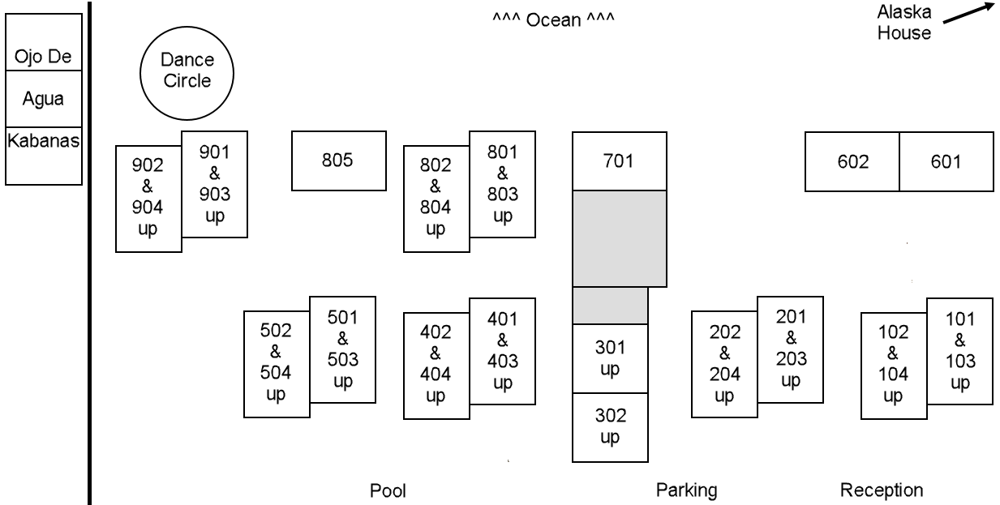

### ***&nbsp;&nbsp;&nbsp;2027 hotel room registration via PMDUP is almost ready to officially open. See below. &nbsp;&nbsp;&nbsp;2027 camp registration will open later this year. [Learn more here.](register.md)***

 For 2027, the official camp dancing will start the evening of Fri Feb 12 and end the evening of Thu Feb 18, with the likelihood of pre- and post-camp dancing on the night before and day/night after.

We have 27 rooms of the 30-room Hotel Las Arenas Puerto Morelos for 10 nights (Wed Feb 10 check-in to Sat Feb 20 check-out) and 1 room for 6 nights (Wed Feb 10 check-in to Tues Feb 16 check-out). We will also do our best to reserve rooms for your additional nights before and after, based on the best-guess dates you provide in the lodging request form.

We are also exploring renting the 6 Ojo De Agua Kabañas, the brown sargasso brick buildings just over the wall next to the dance circle, (to better control our surroundings during camp) and the Alaska House is available possibly both before and after camp as well.

**PLEASE READ CAREFULLY:** **Before completing the lodging request form, it's imperative that you carefully read this entire web page. Thank you!** To participate in the Hotel Las Arenas initial room selection process, you'll be required in the form to agree to the information detailed here.

<!-- 
**The deadline for the Las Arenas initial room selection process has passed and room assignments are being finalized. There are still a couple rooms available, so to check on room availability. To join the waitlist, complete and submit the [Hotel Las Arenas Lodging](https://docs.google.com/forms/d/e/1FAIpQLSct3SrTHl76pMYcZ5z9-eWdLCjCXzf4igqfVk689qA42YuyWA/viewform){:target="_blank"} form, but hold off on sending your non-refundable $100 USD (or 1750 MXN) deposit until you hear from us. (We'll let you know whether you have a room or are on the waitlist as soon as we know. Thanks for your patience!)**
-->
**To participate in the initial room selection process, submit your 1750 peso ($100 USD) *per-person* deposit by the April 15, 2026 deadline.** Your deposit is:
* Non-refundable if you cancel of your own accord.
* Non-refundable in the unlikely event of us losing our nearly $6000 hotel deposit due to circumstances beyond our control (eg, hurricane, change of hotel ownership, etc...).
* Refundable if none of your room preferences are available and you choose to stay elsewhere.

If you aren't open to sending the deposit now or can only attend camp for part of the time, select the appropriate waitlist options on the form to be in the running for rooms still available closer to camp time.

**Important waitlist note:** If you choose being on the waitlist rather than sending the deposit, we highly recommend booking a cancellable reservation elsewhere -- so you can cancel when inevitably something opens up at the hotel last minute (which happens a lot!). Keep in mind that prices tend to skyrocket the closer we get to retreat time, so don't wait. Check out our [Lodging Options](lodging-options.md) web page for many other places we know of to stay in Puerto Morelos.

### Alaska House pricing
Are you interested in staying in the Alaska House before and/or after camp?
* Before camp (Feb 2 - Feb 9) 7 nights - rooms range from $420 to $665 (60 to 95/night)
* After camp (Feb 22 - Mar 9) 15 nights - rooms range from $900 to $1425 (60 to 95/night)

Please express your interest using the **Alaska House** question in the lodging request form.

### Ojo De Agua Kabañas pricing
Are you interested in a more cushy lodging experience during camp?
* 2,200 pesos/night is our discounted 2027 high-season price
* For up to 10 nights (Feb 10 - Feb 20)
* 1st floor rooms have 2 queens; 2nd floor 1 king
* Mini fridge, working TV and AC, but no microwave (so use Las Arenas community kitchen)
* Upscale (but simple/understated) rooms compared to Las Arenas
* Requires a 50% deposit, refundable/cancelable until Jan 10, 2027

Please express your interest using the **Ojo De Agua Kabañas** question in the lodging request form.

### Hotel Las Arenas pricing

The best news ever is the obnoxiously-loud, late-night music bar (Loudo's/LIVE) across the street did not renew their lease! Dave met with the new tenant, Doña Triny! She's moving her traditional Mexican restaurante there with no intention of having music past dinnertime. Thus, rooms toward the north end of the property should be the quietest again. Alhumdulillah!

This year, roommate prices are listed ***per person in pesos*** (with convenient USD & CAD conversion charts to give you an idea of the equivalent dollar amounts as rates fluctuate). Given what we know as of March 15, 2026, the group block prices ***per person (based on double occupancy)*** for stays of up to 10 nights between Wed Feb 10 check-in and to Sat Feb 20 check-out are ***most likely*** going to be:
* 5,400 Poolside - No Ocean View (101,202,301,302,401,402,403,404,501,502)
* 6,200 Poolside - Partial Ocean View (103,104,201,203,204,503,504)
* 7,000 Beachside (601,602,801,802,805,901,902,903,904)
* 5,100 Beachside with sink, king, and queen for three people (701)
* 2,400 *6 nights (2/10-2/16) only* - Beachside 2nd floor, 2 queens (804)

Consider staying longer to explore cenotes, ruins, the reef, and more... Room prices for each additional night before Wed Feb 11 and/or Sat Feb 21 and after are:
* 1,400 (700 each for two) Beachside
* 1,200 (600 each for two) Beachside when 7+ extra nights
* 1,100 (550 each for two) Beachside when 14+ extra nights
* 1,100 (550 each for two) Poolside

This chart shows 10-night ***per person (based on double occupancy)*** totals for each room type at various conversion rates for US and Canadian dollars. The middle column (**bold**) in each section is the current rate.
<iframe src="https://docs.google.com/spreadsheets/d/e/2PACX-1vTDckeEMkl5WNncTCorD4BsafpMtjgR-G4p_tTiiqvTOntXRtWurbfdsydHeOsFXK3QUT-7XaQCGttY/pubhtml?gid=697006945&amp;single=true&amp;widget=true&amp;headers=false" width="640" height="300"></iframe>

When to convert dollars to pesos is up to you this year. The [**Payment**](#payment) section below provides a description of the process used to do conversions. 

### Approximate your total

To approximate the up-to-the-minute cost of your entire stay in your currency:
1. Select your source currency below (if not USD).
2. Enter your peso total in the MXN box.
3. Divide the source currency result by 1.0055 to include the mas-o-menos 1/2% estimated Wise conversion fee.

<iframe
  title="fx"
  src="https://wise.com/gb/currency-converter/fx-widget/converter?sourceCurrency=USD&targetCurrency=MXN&amount=1"
  height=290
  width=700
  frameBorder="0"
  allowtransparency="true"
></iframe>

# [Reserve your room](https://docs.google.com/forms/d/e/1FAIpQLSct3SrTHl76pMYcZ5z9-eWdLCjCXzf4igqfVk689qA42YuyWA/viewform){:target="_blank"}
To participate in the Las Arenas initial room selection process, complete and submit [**the PMDUP Lodging Request form**](https://docs.google.com/forms/d/e/1FAIpQLSct3SrTHl76pMYcZ5z9-eWdLCjCXzf4igqfVk689qA42YuyWA/viewform){:target="_blank"}, agree to register for camp within a week of registration opening later this year, and send your 1750 peso ($100 USD) deposit by the deadline.<!-- reserve your room while they last (they are going fast!) and pay separately.join the waitlist.-->

<!-- Keep next heading and image on one to lessen vertical spacing -->
### Hotel Las Arenas Building Layout {:.thinblackborder}

[See the ocean view (or lack thereof) from each room.](./las-arenas-views.md)

### Hotel Las Arenas initial room selection process

Like last year, we will attempt to fit everyone who has their deposit in by the Las Arenas initial selection deadline into the Tetris puzzle of rooms and room preferences. Hopefully, the process will take less time than the month or more of followups it took last year.

Success of the process relies on communication, cooperation, compromise, trust, and patience of all involved. The process is ***not a competition***. It's ***not*** about you necessarily getting the best room for you. Rather, it's a way to meet your community in *love, harmony, and beauty* to achieve the best possible overall outcome for all involved, by providing the opportunity for the greatest number of dancers to live together in community for 10 days in a beautiful, sunny, warm, ocean-breeze-filled, magical spot on the planet while it's cold and wintery back home.

When we all energetically participate in this way, minor miracles happen. For example, last year one dancer graciously stepped forward and volunteered to switch to a noisy poolside room to make the Tetris puzzle work, only to eventually, after all the shuffling, wind up in the beach room that was dancer's initial first choice.

Ya Waliyy (divine cooperation)!! Ya Saboor (divine patience)!!

Based on the 16-choice **Fairness** question on last year's form, the community, by a wide margin, favors giving lodging priority to camp registrants with disability/mobility concerns that require special consideration (17%), followed by having two camp registrants in each room (12%). Last year, 10 camp registrants were left stranded on the waitlist, so having a solo room or a non-registrant roommate is highly unlikely this year. Please be prepared to honor the community's preferences.

Other points of note:
* Sending your deposit by the deadline is ***not a race***. The "first come, first served" adage applies only for any rooms/beds still available after the initial selection process. 
* If you select **I'll choose a roommate later** in this year's form and 50 people send deposits before the person you choose sends their deposit, your roommate will need to be one of those 50 people.
* In the event that the Tetris puzzle cannot be solved via everyone cooperating, we'll use some form of a lottery (TBD depending on what's making the puzzle unsolvable).

### Payment

We'll again accept payment via Wise, Venmo, or PayPal (just like we did last year). But if you don't do electronic payments, you can mail a US check.

*To participate in the Hotel Las Arenas initial room selection process, your 1750 peso ($100 USD) non-refundable deposit must be received by April 15, 2026.<!--Your stay is not reserved and your room preference is not prioritized until your $100 USD non-refundable deposit is received.--> **Deposits are per person (not per room).***

Once the Tetris puzzle is solved and you approve your room assignment, we'll send you a payment request for the **Amount Now** you specify in the form via the **Pay Via** method you specify in the form. (If you are paying in dollars, we'll convert money to pesos first, then request the equivalent dollar amount from you.)

We will do the same at the pay **Balance by** date or rate selection you specify in the form or at any point you desire (before Jan 15, 2027) that you feel the exchange rate and calendar are right for you. Keep in mind that typically the rate is the worst for tourists in January and February because of the oncoming high season. We will periodically post exchange rate notices in the **Announcements** chat, so be sure to keep WhatsApp available.

### Cancellation policy

Full refund (less 1750 peso non-refundable deposit) with sufficiently-creative excuse, provided there are still people on the waitlist and your room gets filled. Cancellation close to retreat time may result in partial or no refund.

# What to expect at our favorite 2-star hotel

We set up a simple community kitchen in room 102. It has:

* Microwave
* Two-burner hot plate
* Larger mini fridge
* Sink
* Dish rack
* Coffee maker
* Water kettle
* Small selection of pots, pans, dishes, silverware, and cooking utensils.
* 20L drinking water dispenser (provided here as part of your stay. Water is also available for your individual rooms for a nominal fee.)
* Safe (for people without one in their room)

> Please clean your cooking dishes **before** eating, so others can use them. And please thoroughly clean up after yourself! Your mother doesn't live here... (...unless you're name is Amber! :-) )

While it's "the finest 2-star Mexican hotel on the beach you'll ever meet", staying does have its drawbacks. But hey, it's Mexico!

* Hot water might not be available at all times.
* Most rooms have torn or missing screens. Each year they do their best to fix them for us.
* Not all rooms have fridges, safes, microwaves. Use the ones in the community kitchen (room 102) if you don't have them in your room.
* Not all rooms have TVs and there is no cable (just WiFi for your NetFlix, etc). 
* Not all rooms have working fans and air conditioners, though they tend to get them fixed quickly.
* It might take a couple of days to get:
  * A second room key
  * Batteries replaced in the safe
  * Water for individual rooms
  * Etc...
* The toilet seat hinges tend to break easily.
* Like everywhere in Mexico, toilet paper goes in the trash, ***not the toilet***.
* Shampoo yes, but no conditioner, body gel, or body lotion is provided.
* Some refrigerators have broken or missing shelves. Tape can be a partial remedy.
* Freezers tend to drip water into the refrigerators.
* Hot water handles in the king room showers get scalding hot and can burn.
* Gaps in door and window frames allow sand and mosquitos.
* Any food you leave out will attract hundreds of ants.
* Some rooms have poor mattresses.
* Interesting smells occasionally rise from the shower drains, especially after a hard rain.

# Questions

> Still have questions? Use our [**questions & suggestions form**](https://docs.google.com/forms/d/e/1FAIpQLSeKsY-e9iy44578E1ijjs_g5Bwi1gZCuW439N1bOBlL76U5qg/viewform){:target="_blank"} (found in the **Quick Jump** menu under **Contact Us**) or view [Lodging Options](lodging-options.md) for other hotel info.