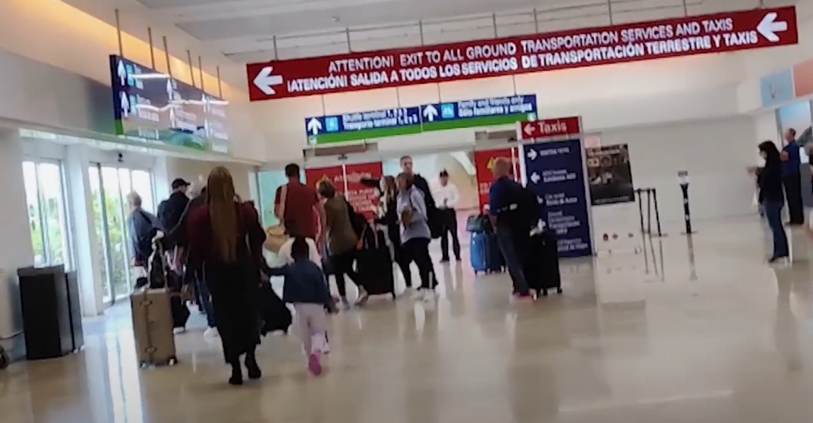

Like arriving at any international destination, at the [Cancun International Airport (CUN)](https://www.cancunairport.com/){:target="_blank"} you proceed through:
* Immigration/passport control - Tourist entry cards and customs declaration forms are no longer used at CUN. You can enter through the traditional customs desks, or if you have an e-passport (look for camera icon on the cover), you can get through much more quickly using the e-gates.
* Baggage claim - Bags typically appear at baggage claim a minimum of 45 minutes after your plane arrives because they now all get scanned by customs before being delivered to the baggage carousel.
* Customs - These days, you might walk right through the customs area without even knowing it! Customs inspection is still random, but the red light/green light system is no longer used. If you get selected/approached by a customs officer, you'll be asked some questions and/or be directed to put your luggage through a TSA-type scanner.

Once you've passed through the customs doors, you need to navigate your way through the vendors to find the curb and your ride. CUN is becoming more and more like a US domestic airport each year. But... the vendors outside of customs can seem intimidating and finding your ride at the curb can be a bit tricky. This page provides tips for each terminal to more seamlessly guide you through the process. 

# Terminal 2
* [CUN Terminal 2](https://www.cancunairport.com/terminal-2.html){:target="_blank"} on the CUN website gives a general description of the terminal and lists the airlines that use it.
* For domestic flights (coming from elsewhere in Mexico), there is no immigration/passport control or customs.
* Proceed directly to baggage claim.
* To find your ride: 
  * If we've arranged a ride for you, exit the building, locate door 6, and walk across the passenger pickup area toward the little park/grassy area to meet your driver.
  * If you've prearranged a commercial ride yourself, follow the instructions you've been given from the ride company. 
  * If you are renting a car, look for your rental company desk before exiting the building.

# Terminal 3
* [CUN Terminal 3](https://www.cancunairport.com/terminal-3.html){:target="_blank"} on the CUN website gives a general description of the terminal and lists the airlines that use it.
* After deplaning, you'll walk through some long hallways and go down some stairs/escalator to get to immigration/passport control.
* You'll enter a very large room with many lines. Sometimes the room is relatively empty; sometimes there are hundreds of people. If the room is busy and your passport doesn't expire in the next 180 days, consider using the automated e-gates at the far end of the room to typically get through faster. This is especially useful if you don't need to wait for bags.
* After immigration/passport control, you'll pass through some doors to the duty-free and baggage claim area with typical airport conveyor belts.
* Once you have your bags, you'll walk through the customs area (wide hallway). Unless a customs officer stops you, just keep walking.
* You'll pass through another set of doors and suddenly be in a whole different world where all the vendors try to sell you things. Just say "No gracias" to the vendors and keep walking.
* To find your ride: 
  * If we've arranged a ride for you, exit the building, ***immediately*** turn to the left, go under the sign to the **Family and Friends** area, hug the building wall, walk past Berryhill Bar, go through the gate to the very first parking spot to meet your driver.
  * If you've prearranged a commercial ride yourself, exit the building, walk straight to where all the people and cars are, and follow the instructions you've been given from the ride company. 
  * If you are renting a car, look for your rental company desk before exiting the building.

# Terminal 4
* [CUN Terminal 4](https://www.cancunairport.com/terminal-4.html){:target="_blank"} on the CUN website gives a general description of the terminal and lists the airlines that use it.
* After deplaning, you'll walk through some long hallways and go down some stairs/escalator to get to immigration/passport control.
* You'll enter a very large room with many lines. Sometimes the room is relatively empty; sometimes there are hundreds of people. If the room is busy and your passport doesn't expire in the next 180 days, consider using the automated e-gates at the far end of the room to typically get through faster. This is especially useful if you don't need to wait for bags.
* After immigration/passport control, you'll pass through some doors to the duty-free and baggage claim area with typical airport conveyor belts.
* Once you have your bags, you'll walk through the customs area (wide hallway). Unless a customs officer stops you, just keep walking.
* You'll pass through another set of doors and suddenly be in a whole different world where all the vendors try to sell you things. Just say "No gracias" to the vendors and keep walking.
* There are two building exits that go to two completely different places. So to find your ride:
  * If you've prearranged a commercial ride yourself, follow the instructions you've been given from the ride company. 
  * If you are renting a car, look for your rental company desk before exiting the building.
  * If we've arranged a ride for you, after baggage claim, follow signs for **Family and Friends Only** and as you approach the exits, *don't follow the big red sign* and the flow of foot traffic going left. Instead proceed straight and exit through the **Family and Friends Only** exit door. Once outside, turn to the right, and walk past the crowd to a less-populated spot just past the orange cones.  

# Meeting our drivers

Only non-commercial friends and family members are allowed to pick people up at **Family and Friends Only**. If anyone tries to talk to you while you are waiting at the curb for our driver to pull up, simply point to the street and ask "Family and Friends?" and they'll usually point where to stand.

Say nothing else! If you mention the word taxi, car, driver, or anything else that indicates you are being picked up be someone other than your friend or family member, they might not let you get in the car because the area is just for non-commercial pickups.

Do not take money out or say anything about money. Once you get to Puerto Morelos, you can pay your driver.

# VisiTAX
During Covid, QRoo instituted a [visiTAX](https://www.cancunairport.com/visitax.html){:target="_blank"}. They say it's mandatory, but collection is not enforced and paying can only be done online, so paying it is essentially voluntary.

Occassionally in the main departures area, someone might stop you and ask if you've paid it. It's been our experience that getting online in that moment is time consuming and often doesn't work, so we suggest saying you are nervous about making your flight and you'll look into it later. At that point, they say ok and you can walk away. Once you are at your gate, if you desire, you can voluntarily get online and pay it.