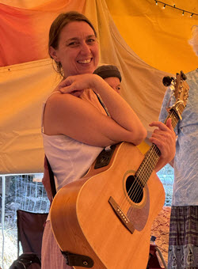
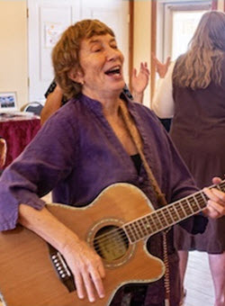
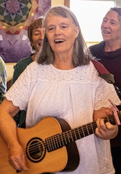
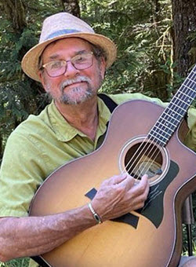
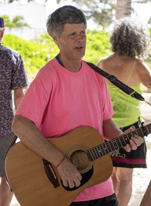
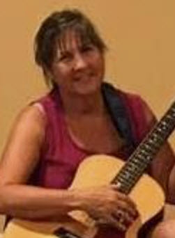
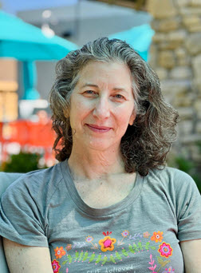
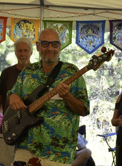

# Dance leaders

* Main leaders
  * Jen Friedman, Spiritual Director
  * Sky Safir Roshay
  * Connie Zareen Delaney
* Supporting leaders
  * Dave Nur al-Haqq Walker
  * Douglas Stevenson
  * Jessie Sitara Noe
  * Robin Schnitzler

# Administration

* Registrar, camp manager
  * Wayne Talmadge
* Lodging coordinator, transportation coordinator
  * Dave Nur al-Haqq Walker

# A bit about us

<!--  -->

| Bios |      |
| ---: | :--- |
|  **Jen Friedman** Once a touring singer/songwriter with two original folk albums, Jen is a certified leader & mentor-in-training. With a down-to-earth, warm and welcoming style, for 16 years she has led Dances and sacred singing in Longmont and Lafayette, CO and at retreats & festivals in North/South America and Mexico, including at the last 3 Parliament of the World’s Religions.  She is honored to serve as Executive Director for DUP North America and this year as Spiritual Director of our camp. Jen has been personally transformed by the direct transmission of Source energy and wisdom that the Dances offer while fostering a communal sense of peace. She is also an interfaith hospital chaplain. Learn more at [www.jenniferfriedman.com](https://www.jenniferfriedman.com){:target="_blank"} | &nbsp;  |
|  &nbsp; |  **Sky Safir Roshay** Sky has been organizing Dance camps in the United States and Mexico since 1999. She also facilitates “Deeper Dance” conversations at camps, where the synergistic wisdom of participants reveals wisdom about the energy and practice of the Dances, their role in our lives, and the way they can anchor spiritual truths into our way of being in the world and transform our reality.  Sky has been leading Dances at the Canyonlands/Paonia camps with Bernie for 25 years. |
|  **Connie Zareen Delaney** Zareen is a multifaceted Dance leader and teacher with training and certifications in diverse cultures and movements from traditional Sufism, to the Osho Multiversity, Evolutionary Enlightenment and ancient wisdom teachings.  Zareen's goal is to explore things in a way that creates a new perception. Most important is how we use our time to re-create ourselves into participating relatives of the world rather than individual consumers. Her overall vision is to come alive in new ways and jumpstart a dynamic participation in life that transforms the world… In other words: Sam Lewis’ peace project. | &nbsp;  |
|  &nbsp; |  **Douglas Stevenson** A musician since childhood, Douglas has found the most fulfillment in leading, singing, and chanting with the Dances of Universal Peace. He has led dances in circles across the U.S., Mexico, Guatemala, and New Zealand, supported the Beyond Initiative Caravan in Turkey and Vietnam, and pilgrimaged to India for the Urs of Hazrat Inayat Kahn.  In 2023, he joined the Board of DUP North America and became treasurer of DUP International. Douglas and his wife Deborah have been members of [The Farm](https://thefarmcommunity.com/){:target="_blank"} for over 50 years, a spiritual community founded on the principles of nonviolence and respect for the earth. When home in Tennessee, their Farm Dance Sangha gets together on Sunday afternoons. |
|  **Dave Nur al-Haqq Walker** Nur al-Haqq has been leading for almost 30 years, is a founding leader of the Canyonlands retreat, was the spiritual director of the first Southern California Quarterly, and has led Dance workshops across the US.  He met the Dances at Bernie's circle in Hotchkiss, CO in 1996 and instantly knew they'd be in his life from that moment forward. He spent 10 years as the webmaster for the DUP website, created the **Find Dances** database still in use today, and loves spending up to two months each winter in Puerto Morelos. | &nbsp;  |
|  |  **Jessie Sitara Noe** Jessie Sitara lives in Northern Michigan where she leads a small circle. She has been coming to camp for over 10 years and, in addition to leading, offers qigong on the beach for us each morning. She's attended retreats in Spain, England, Germany, and the Czech Republic, and has been registrar and on the planning team for the Midwest DUP retreat.  In 2003, she discovered the Dances while traveling, immediately fell in love, 6 months later found the Dances close to home, and within a year, began leading. Leading and being in dance circles, connecting with the Oneness in each person has changed her life and deepened her relationship with Spirit. Her guiding mantra is *Let me do thy will, Allah*.
|  **Robin Schnitzler** Robin lives in Madison, WI with her husband/DUP musician Michael Hopwood where they regularly lead dances together. She is a certified dance leader in her 30th year of dancing in the Circle. Robin has enjoyed being part of the Puerto Morelos camps since 2016 and is delighted to join the leadership team this year.  Robin is a dance leadership committee member and leader focalizer for the annual Midwest DUP Retreat. She leads dances at DUP camps, community song circles and retreats, and for community groups throughout the US and in Mexico. Robin loves the way the dances invite all other parts of life to drop away and allow us to drop into our hearts and souls. | &nbsp;  |
|  |  **Wayne Talmadge** Wayne has been involved in Dances of Universal Peace camps as registrar, camp manager, and/or dance tent guru for over 20 years.  As part of the [Mystic Dance Caravan](https://mysticdance.com){:target="_blank"}, he travels throughout the Western US contributing to dance camps as a bass player and assisting with any tasks that need doing.|