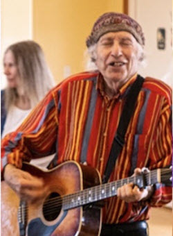
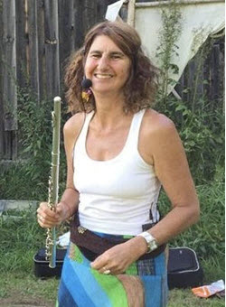
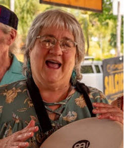
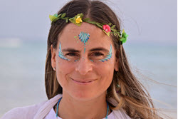

# Dance leaders

* Main leaders
  * Jen Friedman, Spiritual Director
  * Connie Zareen Delaney
* Supporting leaders
  * Nur al-Haqq Dave Walker
  * Douglas Stevenson
  * Jessie Sitara Noe
  * Robin Schnitzler
  * Helga Schleeh
  * Mana'ar Johnson
  * Ana Gaby Fernandez

# Administration

* Registrar, camp manager
  * Wayne Talmadge
* Lodging coordinator, transportation coordinator
  * Nur al-Haqq Dave Walker

<!--
|  &nbsp; |  **Bernie Heideman** Bernie has been leading for over 30 years, was a founding leader at the original Canyonlands Camp, is on staff for Wilderness Camp, started the Puerto Morelos Winter Dance retreat, and has led at other events in the US, Europe and Russia. He is a master at explosive joy and wild energy, but underneath that apparent frivolity he is always guiding us into the presence of “Presence.”  He brings a lot of joy, laughter and music circles to his events and can hold a huge space for everyone to first expand into and then to sink into the depths of their own soul experience. |
|  &nbsp; |  **Sky Safir Roshay** Sky has been organizing Dance camps in the United States and Mexico since 1999. She also facilitates “Deeper Dance” conversations at camps, where the synergistic wisdom of participants reveals wisdom about the energy and practice of the Dances, their role in our lives, and the way they can anchor spiritual truths into our way of being in the world and transform our reality.  Sky has been leading Dances at the Canyonlands/Paonia camps with Bernie for 25 years. | -->

# A bit about us

<table>
<!--  <tr><th colspan="2" style="width: 100%; text-align:center;">Bios</th></tr> -->
  <tr><td style="width: 50%; text-align:right;"> &nbsp;</td><td style="width: 50%; text-align:left;"><b>Jen Friedman</b> Jen is a certified leader and mentor in the DUP tradition. With a down-to-earth, warm, and welcoming style, she has led Dances for 18 years at her local circles in Longmont and Lafayette, CO; alongside Bernie and Sky at Canyonlands and other camps; at events in North/South America and Mexico, including the last 3 Parliament of the World’s Religions.  Jen also serves as an interfaith hospital chaplain, Executive Director for DUP North America and is honored to carry forward Bernie’s legacy as Spiritual Director of our PM camp. She was hit by the proverbial thunderbolt in a circle with Bernie at a music festival some 20 years ago and has been on a profound path of spiritual transformation and service ever since. Learn more at <a href="https://www.jenniferfriedman.com" target="_blank">www.jenniferfriedman.com</a></td></tr>
  <tr><td style="text-align:right;"><b>Connie Zareen Delaney</b> Zareen is a multifaceted Dance leader and teacher with training and certifications in diverse cultures and movements from traditional Sufism, to the Osho Multiversity, Evolutionary Enlightenment and ancient wisdom teachings.  Zareen's goal is to explore things in a way that creates a new perception. Most important is how we use our time to re-create ourselves into participating relatives of the world rather than individual consumers. Her overall vision is to come alive in new ways and jumpstart a dynamic participation in life that transforms the world… In other words: Sam Lewis’ peace project.</td><td>&nbsp; </td></tr>
  <tr><td style="width: 50%; text-align:right;"> &nbsp;</td><td style="width: 50%; text-align:left;"><b>Douglas Stevenson</b> A musician since childhood, Douglas has found the most fulfillment in leading, singing, and chanting with the Dances of Universal Peace. He has led dances in circles across the U.S., Mexico, Guatemala, and New Zealand, supported the Beyond Initiative Caravan in Turkey and Vietnam, and pilgrimaged to India for the Urs of Hazrat Inayat Kahn.  In 2023, he joined the Board of DUP North America and became treasurer of DUP International. Douglas and his wife Deborah have been members of <a href="https://thefarmcommunity.com" target="_blank">The Farm</a> for over 50 years, a spiritual community founded on the principles of nonviolence and respect for the earth. When home in Tennessee, their Farm Dance Sangha gets together on Sunday afternoons.</td></tr>
  <tr><td style="text-align:right;"><b>Nur al-Haqq Dave Walker</b> Nur al-Haqq has been leading for almost 30 years, is a founding leader of the Canyonlands retreat, was the spiritual director of the first Southern California Quarterly, and has led Dance workshops across the US.  He met the Dances at Bernie's circle in Hotchkiss, CO in 1996 and instantly knew they'd be in his life from that moment forward. He spent 10 years as the webmaster for the DUP website, created the <b>Find Dances</b> database still in use today, and loves spending up to two months each winter in Puerto Morelos.</td><td>&nbsp; </td></tr>
  <tr><td style="width: 50%; text-align:right;"> &nbsp;</td><td style="width: 50%; text-align:left;"><b>Jessie Sitara Noe</b> Jessie Sitara lives in Northern Michigan where she leads a small circle. She has been coming to camp for over 10 years and, in addition to leading, offers qigong on the beach for us each morning. She's attended retreats in Spain, England, Germany, and the Czech Republic, and has been registrar and on the planning team for the Midwest DUP retreat.  In 2003, she discovered the Dances while traveling, immediately fell in love, 6 months later found the Dances close to home, and within a year, began leading. Leading and being in dance circles, connecting with the Oneness in each person has changed her life and deepened her relationship with Spirit. Her guiding mantra is <i>Let me do thy will, Allah</i>.</td></tr>
  <tr><td style="text-align:right;"><b>Robin Schnitzler</b> Robin lives in Madison, WI where she leads Dances with her husband/DUP musician Michael Hopwood. She is a certified dance leader in her 30th year of dancing in the Circle. Robin has enjoyed being part of the Puerto Morelos camps since 2016 and is delighted to again join the leadership team this year.  Robin serves on the DUPNA board and on the annual Midwest DUP Retreat leadership committee. She leads dances at DUP camps, community song circles and retreats, and for community groups throughout the US and in Mexico. Robin loves how the dances invite everyday life to drop away and allow us to drop into our hearts and souls.</td><td>&nbsp; </td></tr>
  <tr><td style="width: 50%; text-align:right;"> &nbsp;</td><td style="width: 50%; text-align:left;"><b>Helga Schleeh</b> Helga is a certified Dance leader since longer than she would care to admit……the hair is now white…. and has led in various places in Quebec, Ontario, Costa Rica, Newfoundland, and Mexico. She has been playing music for many years-including original songs for peace at the United Nations Secretariat and several vigils for Peace on the Grand stage in Central Park in New York.  She plays flute, voice, and guitar and a mean set of spoons! She studied, played, recorded, and did artwork for CDs with Saadi (Neil Douglas Klotz) and was mentored by Christina Pleszczynska and Munira Avinger. She is working on a CD with her partner, Marc Poellhuber- music for meditation and original songs. Helga is also an accomplished fine artist and leads very engaging watercolor workshops at the PM camp.</td></tr>
  <tr><td style="text-align:right;"><b>Mana'ar Johnson</b> Mana’ar has been leading Dances of Universal Peace for over 25 years, beginning in Atlanta, where she led retreats, monthly dances, and dances at solstice and equinox. Since 2018, she has been instrumental in keeping the Dances alive in Silver City, NM.   A Quaker and a Sufi and a student of the Divine Feminine, Mana’ar is a cherag who has led the Service of Universal Peace at Puerto Morelos and other camps. She loves swimming in Mother Ocean, which draws her back time and again to enjoy this beautiful setting with beautiful souls.</td><td>&nbsp; </td></tr>
  <tr><td style="width: 50%; text-align:right;"> &nbsp;</td><td style="width: 50%; text-align:left;"><b>Ana Gaby Fernandez</b> Ana Gaby (Anuar) was born in Mexico D.F. and since 2006 she has trained as a holistic healer in multiple modalities including Quantum Healing, Numerology, Reiki and more. In 2011, she discovered the Dances and participated in her first dance leader training in the Ecoaldea Atlántida, Cauca, Colombia. She is a certified Dance leader and the founder of the Riviera Maya, Mexico DUP circle. She has participated and led Dances at many events, festivals, full moon ceremonies in Mexico, United States, Spain and Portugal. Ana Gaby is a long-time attendee and leader at the Puerto Morelos camp and has offered a deep and heartfelt cacao ceremony experience each year that she has attended.</td></tr>
  <tr><td style="text-align:right;"><b>Wayne Talmadge</b> Wayne has been involved in Dances of Universal Peace camps as registrar, camp manager, and/or dance tent guru for over 20 years.  As part of the <a href="https://mysticdance.com" target="_blank">Mystic Dance Caravan</a>, he travels throughout the Western US contributing to dance camps as a bass player and assisting with any tasks that need doing.</td><td>&nbsp; </td></tr>
</table>