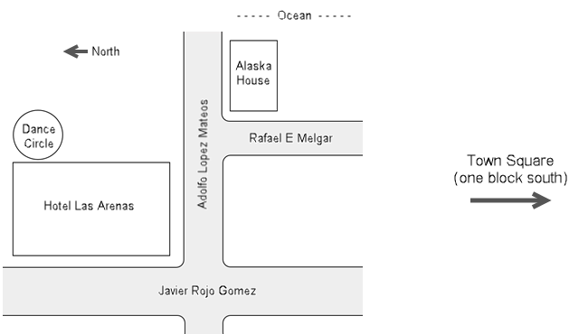



{:.noborder}

Hotel Las Arenas Puerto Morelos is an affordable 2-star hotel on the beach consisting of 30 rooms in 10 separate buildings. It's clean, definitely not "the Ritz", and has its quirks! "It's Mexico!" 

  * Best price on the beach by far, especially with our 10-day, entire hotel group rate!
  * Most rooms have microwaves, mini fridges, beach towels, and hot water most of the time.
  * Make friends with the geckos, keep food sealed to avoid attracting ants, and a little bit of tape on torn screens keeps the mosquitos out... You get the idea...
  * We'll be setting up a simple community kitchen and chill space in one of the rooms.

> **Hotel Las Arenas lodging registration is open. [Learn more here.](booking-las-arenas.md)** 
Additional lodging is available at many places around town. [Learn more here.](lodging-options.md)

The Alaska House (aka "the dance house") is a five-bedroom rental property right on the beach with a beautiful, fenced patio and an amazing ocean view.
  * Staff stays here during camp and other extended-stay dancers move in as staff departs. This year, we have the house for a whole month!
  * Dancers are welcome most anytime, but the full kitchen is reserved for use by only those staying in the house.